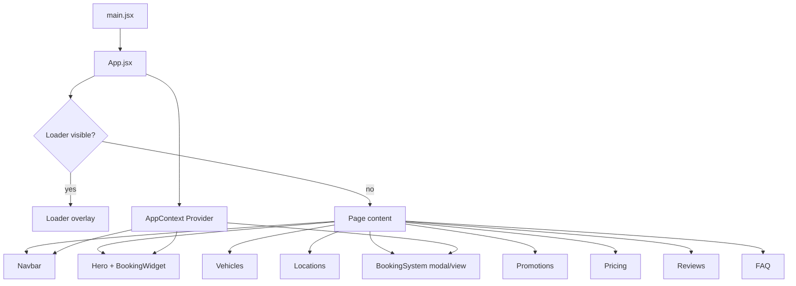
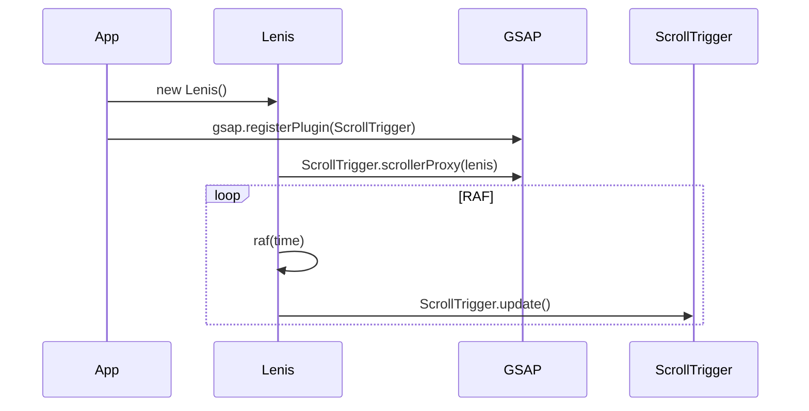

# Design Document: car-rental-frontend

## Overview

A premium car rental single-page application built with React + Vite. The site blends a fully usable booking experience with cinematic, award-site-level animations. The visual language is dark-themed with neon purple/blue accents and pervasive glassmorphism. All data is served from in-memory dummy datasets through API placeholder hooks that are structurally identical to real HTTP calls, enabling zero-refactor backend integration.

### Technology Stack

| Concern | Library |
|---|---|
| Framework | React 18 + Vite |
| Styling | Tailwind CSS v3 |
| Declarative animation | Framer Motion |
| Scroll-driven animation | GSAP + ScrollTrigger |
| Smooth scroll | Lenis |
| Map / globe | react-simple-maps or custom SVG canvas |
| State management | React Context + `useReducer` |
| Date handling | date-fns |

---

## Architecture

### High-Level Structure

```
src/
├── api/                    # API placeholder layer
│   ├── cars.js
│   ├── rentals.js
│   ├── locations.js
│   ├── pricing.js
│   └── promotions.js
├── data/                   # Dummy datasets
│   ├── cars.js
│   ├── locations.js
│   ├── pricing.js
│   ├── promotions.js
│   └── reviews.js
├── context/
│   └── AppContext.jsx       # Global state (mode, booking, scroll)
├── hooks/
│   ├── useLenis.js
│   ├── useMagneticHover.js
│   ├── useTilt.js
│   └── useScrollTrigger.js
├── components/
│   ├── Loader/
│   ├── Navbar/
│   ├── Hero/
│   ├── BookingWidget/
│   ├── Vehicles/
│   ├── Locations/
│   ├── BookingSystem/
│   ├── Promotions/
│   ├── Pricing/
│   ├── Reviews/
│   ├── FAQ/
│   └── ui/                 # Shared primitives (GlassCard, NeonBadge, etc.)
├── utils/
│   ├── pricing.js          # Billing decomposition logic
│   └── validation.js       # Form validation helpers
├── App.jsx
└── main.jsx
```

### Rendering Flow



### Scroll / Animation Initialization



---

## Components and Interfaces

### Loader

```
<Loader onComplete={() => setLoaderDone(true)} />
```

- Renders a full-screen fixed overlay (`z-[9999]`).
- Internally drives a progress value from 0 → 100 over ≥1.5 s using `useEffect` + `requestAnimationFrame`.
- Waits for `document.readyState === 'complete'` before triggering exit animation.
- Exit: Framer Motion `AnimatePresence` with a vertical slide-up + fade.
- Displays brand name with a character-stagger entrance.

Props: `onComplete: () => void`

---

### Navbar

```
<Navbar sections={sections} />
```

- `sections`: array of `{ id, label }` used to render nav links and drive Lenis scroll-to.
- Scroll state tracked via `window.scrollY` listener.
- At `scrollY === 0`: `position: fixed`, centered horizontally (`left-1/2 -translate-x-1/2`), pill shape.
- At `scrollY > 80`: transitions to `top-0 left-0 w-full` with backdrop-blur glass style.
- Transition: Framer Motion `layout` + `animate` props, max 400 ms.
- Magnetic hover: `useMagneticHover` hook applies `transform: translate(dx, dy)` on `mousemove` within a bounding radius.

---

### Hero

```
<Hero />
```

- Full-viewport section (`h-screen`).
- Background: animated CSS gradient mesh or looping GSAP keyframe animation on pseudo-elements.
- Mouse-follow glow: `onMouseMove` updates a CSS custom property `--glow-x / --glow-y`; a radial gradient overlay reads those values.
- Headline: Framer Motion `staggerChildren` on word spans, total duration ≤ 1.2 s.
- Parallax: GSAP ScrollTrigger `scrub: true` on background layer, `y: "30%"` at bottom of viewport.
- Contains `<BookingWidget />`.

---

### BookingWidget

```
<BookingWidget onSubmit={(formData) => openBookingSystem(formData)} />
```

Props: `onSubmit: (BookingFormData) => void`

Internal state: `BookingFormData` (see Data Models).

Validation rules (enforced before `onSubmit`):
- Return date must be strictly after pickup date.
- Both location fields must be non-empty.

Drop-off charge hint: shown when `returnLocation !== pickupLocation`.

---

### Vehicles

```
<Vehicles />
```

- Fetches from `getCars()` API placeholder on mount.
- Local state: `activeClassFilter`, `activeLocationFilter`.
- `<CarCard />` sub-component receives a single `Car` object.
- 3D tilt: `useTilt` hook — `onMouseMove` computes `rotateX` / `rotateY` from pointer offset within card; reset on `mouseLeave` within 300 ms.
- Glow: CSS box-shadow driven by same pointer offset.
- Filter transitions: Framer Motion `AnimatePresence` + `layout` on the card grid.
- Scroll entrance: GSAP ScrollTrigger stagger on card elements.

---

### Locations

```
<Locations />
```

- Fetches from `getLocations()` on mount.
- Renders an SVG-based map (react-simple-maps) or a custom canvas globe.
- Each marker: `<LocationMarker location={loc} />` — glowing pulsing dot.
- Hover: tooltip panel with address details.
- Click: smooth zoom/pan to marker coordinates via map library API.
- Scroll entrance: GSAP ScrollTrigger stagger on markers.

---

### BookingSystem

```
<BookingSystem formData={BookingFormData} onClose={() => closeBookingSystem()} />
```

Props:
- `formData: BookingFormData` — pre-populated from widget submission.
- `onClose: () => void`

Internal logic:
- Calls `getPricing()` to resolve per-class rates.
- Calls `getPromotions()` to resolve active promotion.
- Reads `mode` from `AppContext`.
- Computes `assignedClass` (may be upgraded from `requestedClass`).
- Upgrade animation: Framer Motion badge swap with glow keyframe when `assignedClass !== requestedClass`.
- Price breakdown: `decomposeDays(totalDays)` utility → itemised billing units.
- Discount logic: see Data Models / Pricing Logic.
- Odometer validation: `endOdometer >= startOdometer`.

---

### Promotions

```
<Promotions />
```

- Fetches from `getPromotions()`.
- Displays active promotion card with highlighted class badge.
- Scroll entrance: GSAP ScrollTrigger fade-up.

---

### Pricing

```
<Pricing />
```

- Fetches from `getPricing()`.
- Renders four `<PricingCard class={...} rates={...} />` components.
- Hover: Framer Motion `whileHover={{ y: -6, boxShadow: "..." }}`.
- Scroll entrance: GSAP ScrollTrigger stagger.

---

### Reviews

```
<Reviews />
```

- Static dummy data (no API placeholder needed — sourced from `data/reviews.js` directly).
- Carousel: Framer Motion `AnimatePresence` + drag-to-swipe, transition ≤ 500 ms.
- Scroll entrance: ScrollTrigger fade-in on section.

---

### FAQ

```
<FAQ />
```

- Static data array of `{ question, answer }`.
- `<FAQItem />` sub-component: Framer Motion `AnimatePresence` + `motion.div` with `height: "auto"` for smooth expand/collapse.
- Single-open accordion: parent tracks `openIndex` state.
- Scroll entrance: GSAP ScrollTrigger stagger on items.

---

### Shared UI Primitives (`components/ui/`)

| Component | Purpose |
|---|---|
| `GlassCard` | Semi-transparent card with backdrop-blur and neon border |
| `NeonBadge` | Pill badge with gradient border glow |
| `NeonButton` | CTA button with hover glow and scale micro-interaction |
| `GlowDot` | Pulsing location marker dot |
| `SectionWrapper` | Consistent section padding + scroll-reveal wrapper |

---

## Data Models

### Car

```ts
interface Car {
  id: string;           // e.g. "CAR-001"
  make: string;
  model: string;
  year: number;
  color: string;
  carClass: CarClass;   // "Subcompact" | "Compact" | "Sedan" | "Luxury"
  licensePlate: string;
  locationId: string;   // FK to Location.id
  imageUrl: string;
}
```

### Location

```ts
interface Location {
  id: string;           // e.g. "LOC-001"
  name: string;
  streetAddress: string;
  city: string;
  province: string;
  postalCode: string;
  lat: number;
  lng: number;
}
```

### Pricing

```ts
interface PricingEntry {
  carClass: CarClass;
  perDay: number;
  perWeek: number;
  per2Weeks: number;
  perMonth: number;
}
```

### Promotion

```ts
interface Promotion {
  id: string;
  carClass: CarClass;
  discountPercent: number;   // e.g. 20 = 20% off
  label: string;             // e.g. "Weekly Special"
  active: boolean;
}
```

### Review

```ts
interface Review {
  id: string;
  authorName: string;
  rating: number;            // 1–5
  body: string;
  date: string;              // ISO date string
}
```

### BookingFormData

```ts
interface BookingFormData {
  pickupLocation: string;    // Location.id
  returnLocation: string;    // Location.id
  pickupDate: string;        // ISO date string (date only)
  returnDate: string;        // ISO date string (date only)
  requestedClass: CarClass;
}
```

### BookingResult

```ts
interface BookingResult extends BookingFormData {
  assignedClass: CarClass;
  totalDays: number;
  billingBreakdown: BillingLine[];
  dropOffCharge: number | null;
  fuelLevelPickup: FuelLevel;
  odometerStart: number;
  odometerEnd: number;
  finalPrice: number;
}

type FuelLevel = "Empty" | "Quarter" | "Half" | "Three_Quarter" | "Full";

interface BillingLine {
  unit: "month" | "2weeks" | "week" | "day";
  quantity: number;
  unitPrice: number;
  subtotal: number;
}
```

### AppState (Context)

```ts
interface AppState {
  mode: "customer" | "employee";
  loaderDone: boolean;
  bookingFormData: BookingFormData | null;
  bookingSystemOpen: boolean;
}

type AppAction =
  | { type: "SET_MODE"; payload: "customer" | "employee" }
  | { type: "LOADER_DONE" }
  | { type: "OPEN_BOOKING"; payload: BookingFormData }
  | { type: "CLOSE_BOOKING" };
```

---

### Pricing Logic

**Day decomposition** (`utils/pricing.js`):

```
decomposeDays(n):
  months    = floor(n / 30)
  remainder = n % 30
  twoWeeks  = floor(remainder / 14)
  remainder = remainder % 14
  weeks     = floor(remainder / 7)
  days      = remainder % 7
  return [{ unit: "month", qty: months }, ...]  // filter qty > 0
```

**Discount application**:

```
Customer mode:
  if active promotion matches assignedClass:
    price = basePrice * (1 - promotion.discountPercent / 100)
  else:
    price = basePrice

Employee mode:
  if totalDays < 14:
    price = basePrice * 0.50
  else:
    price = basePrice * 0.90
  (promotions never applied)
```

**Drop-off charge**: flat fee defined in `data/pricing.js` (e.g. $49.99), added as a separate `BillingLine` when `returnLocation !== pickupLocation`.

---

## Correctness Properties

*A property is a characteristic or behavior that should hold true across all valid executions of a system — essentially, a formal statement about what the system should do. Properties serve as the bridge between human-readable specifications and machine-verifiable correctness guarantees.*


### Property 1: Loader progress is monotonically non-decreasing

*For any* two elapsed time values `t1 < t2` during the loader animation, `progress(t1) <= progress(t2)`, and `progress` is always in the range `[0, 100]`.

**Validates: Requirements 1.2**

---

### Property 2: Date validation rejects invalid ranges

*For any* pair of dates where `returnDate <= pickupDate`, the booking widget validation function SHALL return an error and the form SHALL not submit.

**Validates: Requirements 4.8**

---

### Property 3: Day decomposition is lossless

*For any* positive integer `n` representing total rental days, `decomposeDays(n)` SHALL produce a list of billing lines whose `quantity × unitDays` values sum exactly to `n`.

**Validates: Requirements 7.5**

---

### Property 4: Odometer validation rejects reversed readings

*For any* pair of odometer values where `endOdometer < startOdometer`, the booking system validation SHALL return an error and prevent confirmation.

**Validates: Requirements 7.10**

---

### Property 5: Customer mode applies promotion discount correctly

*For any* valid booking in Customer_Mode where the active promotion matches the assigned car class, the final price SHALL equal `basePrice × (1 - discountPercent / 100)`, rounded to two decimal places.

**Validates: Requirements 8.2**

---

### Property 6: Employee mode discount is tier-correct and promotion-free

*For any* valid booking in Employee_Mode, the final price SHALL equal `basePrice × 0.50` when `totalDays < 14`, and `basePrice × 0.90` when `totalDays >= 14`. No promotion discount SHALL be applied regardless of any active promotion.

**Validates: Requirements 8.3, 8.4, 8.5**

---

### Property 7: At most one active promotion at any time

*For any* promotions dataset returned by the API placeholder, the count of entries where `active === true` SHALL be at most 1.

**Validates: Requirements 9.2**

---

### Property 8: FAQ accordion single-open invariant

*For any* sequence of FAQ item click events, the count of simultaneously expanded items SHALL never exceed 1.

**Validates: Requirements 12.4**

---

## Error Handling

### Form Validation Errors

| Condition | Error message | Behaviour |
|---|---|---|
| `returnDate <= pickupDate` | "Return date must be after pickup date" | Inline error below date field; submit blocked |
| `pickupLocation` empty | "Please select a pickup location" | Inline error; submit blocked |
| `endOdometer < startOdometer` | "End odometer must be ≥ start odometer" | Inline error on end field; confirm blocked |

### API Placeholder Errors

All API placeholder functions are wrapped in a try/catch. On error they return `{ data: null, error: string }`. Components check for `error` and render a fallback UI (e.g. "Unable to load vehicles — please try again.").

### Asset Loading Timeout

If `document.readyState` does not reach `'complete'` within 8 seconds after the progress bar hits 100%, the Loader exits anyway to avoid an indefinitely blocked UI.

### Class Upgrade Logic

If no car of the requested class is available, the system assigns the next higher class. If no higher class exists, the requested class is assigned (edge case handled gracefully with no upgrade animation).

---

## Testing Strategy

### Unit Tests (Vitest + React Testing Library)

Focus areas:
- `decomposeDays(n)` — concrete examples: 1, 7, 14, 30, 8, 45 days.
- `calculatePrice(booking, pricing, promotion, mode)` — specific examples for each mode/promotion combination.
- `validateBookingForm(formData)` — specific invalid inputs.
- `validateOdometer(start, end)` — specific invalid pairs.
- `BookingWidget` renders all fields and shows drop-off hint when locations differ.
- `FAQ` accordion: clicking a second item closes the first.
- `Loader` exits after progress reaches 100 and assets are ready.

### Property-Based Tests (fast-check)

Library: **fast-check** (TypeScript-compatible, works with Vitest).

Each property test runs a minimum of **100 iterations**.

Tag format in test files: `// Feature: car-rental-frontend, Property N: <property text>`

| Property | Generator inputs | Assertion |
|---|---|---|
| P1: Loader progress monotonic | `fc.float({ min: 0, max: 1.5 })` pairs | `progress(t1) <= progress(t2)` for `t1 < t2` |
| P2: Date validation | `fc.date()` pairs where `return <= pickup` | `validateDates` returns error |
| P3: Day decomposition lossless | `fc.integer({ min: 1, max: 365 })` | `sum(lines.map(l => l.qty * unitDays[l.unit])) === n` |
| P4: Odometer validation | `fc.integer()` pairs where `end < start` | `validateOdometer` returns error |
| P5: Customer discount | `fc.record({ basePrice, discountPercent })` | `finalPrice === basePrice * (1 - discount/100)` |
| P6: Employee discount | `fc.record({ basePrice, totalDays })` | Correct multiplier applied; no promotion effect |
| P7: Single active promotion | `fc.array(fc.record({ active: fc.boolean() }))` filtered to >1 active | `getActivePromotion` returns only one |
| P8: FAQ single-open | `fc.array(fc.integer({ min: 0, max: 9 }))` click sequences | `openCount <= 1` after each click |

### Integration Tests

- API placeholder functions return data matching their TypeScript interfaces.
- Dummy data satisfies minimum counts (≥8 cars, ≥4 locations, ≥4 pricing entries, ≥1 promotion, ≥4 reviews).
- `AppContext` reducer handles all action types without throwing.

### Visual / Animation

- Snapshot tests for `GlassCard`, `NeonBadge`, `NeonButton` to catch unintended style regressions.
- Manual QA checklist for: 60fps scroll performance, glassmorphism rendering, magnetic hover feel, 3D tilt accuracy.
